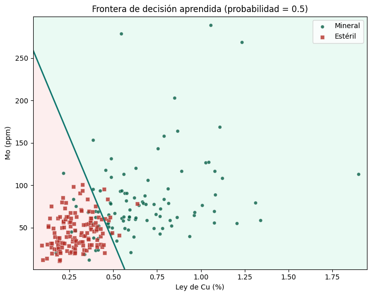
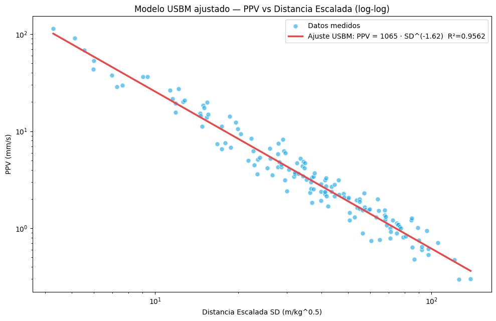
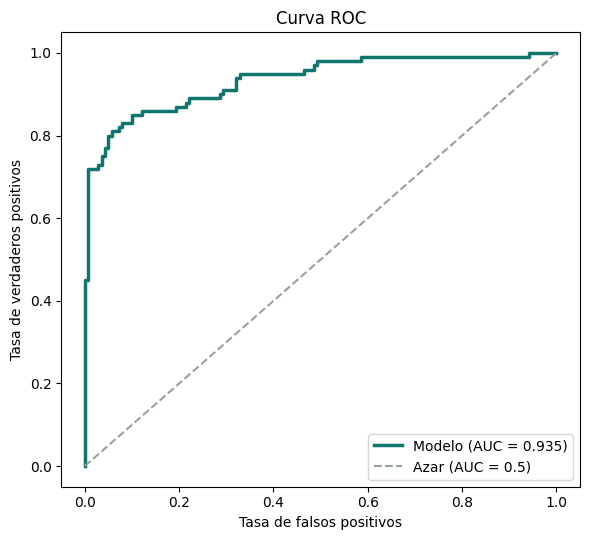
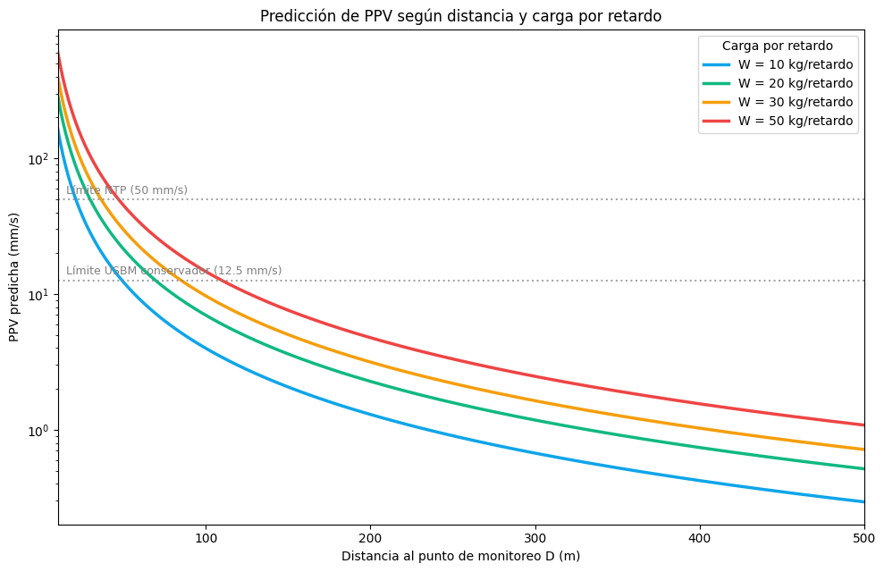

#### Si te resulta util este proyecto, apoyalo con un [](https://github.com/nrgarridoa/talleres-mineria-python/stargazers) en el repositorio.

---

# Talleres · Python aplicado a Minería

> **Cada taller resuelve un problema real de operación minera con datos y código reproducible — no un ejercicio de juguete. Notebook, dataset y modelo validado de principio a fin.**

Este repositorio es el **hub de código** de mis artículos técnicos en [nrgarridoa.github.io](https://nrgarridoa.github.io/articles/): crece con cada artículo nuevo que publico. Cada carpeta es un taller autocontenido — el notebook con el análisis paso a paso y el dataset para replicarlo. Todos fijan una semilla (`2026`) y corren de principio a fin sin intervención manual.

[](https://nrgarridoa.github.io/articles/)

---

## Talleres

<table>
<thead>
<tr><th>Vista previa</th><th>Taller</th><th>Categoría</th><th>Técnica</th><th>Artículo</th></tr>
</thead>
<tbody>
<tr>
<td></td>
<td><a href="mineral-esteril/"><code>mineral-esteril</code></a><br>Clasificar mineral y estéril en un pórfido Cu-Mo</td>
<td>Control de leyes</td>
<td>Regresión logística + CV</td>
<td><a href="https://nrgarridoa.github.io/articles/mineral-esteril/">Leer →</a></td>
</tr>
<tr>
<td></td>
<td><a href="vibraciones-ppv/"><code>vibraciones-ppv</code></a><br>Predecir la vibración (PPV) de una voladura</td>
<td>Voladura / Geomecánica</td>
<td>Modelo USBM (log-log)</td>
<td><a href="https://nrgarridoa.github.io/articles/vibraciones/">Leer →</a></td>
</tr>
</tbody>
</table>

---

<details>
<summary><strong>Hallazgos clave por taller (clic para expandir)</strong></summary>

### `mineral-esteril` — Clasificar mineral y estéril



- La regresión logística con dos variables geoquímicas (Cu, Mo) alcanza **AUC ≈ 0.93** y **~89 % de acierto**, validado con 5-fold CV (AUC 0.929 ± 0.043).
- El modelo recupera la dirección del *ground truth*: el **Cu domina la decisión** (~3× el peso de Mo), consistente con la geoquímica de un pórfido Cu-Mo.
- El umbral de decisión no queda fijo en 0.5: se ajusta minimizando el costo total según cuánto cuesta diluir (falso positivo) frente a perder mineral (falso negativo).

### `vibraciones-ppv` — Predicción de PPV con el modelo USBM



- Modelo ajustado: **PPV = 1065 · SD⁻¹·⁶¹⁸⁵** (R² = 0.956 en espacio log-log), muy cerca del sitio simulado (K=1000, β=1.60).
- Validación cruzada 5-fold estable: **R² = 0.952 ± 0.011**.
- Residuos normales (Shapiro-Wilk, p = 0.128) → los **intervalos de predicción al 95 %** son válidos para diseño conservador.
- Se traduce directo a reglas de campo: carga máxima por retardo y distancia mínima segura según el límite normativo (NTP, USBM).

</details>

---

## Cómo está organizado

Todos los talleres siguen la misma convención, para que agregar uno nuevo sea copiar el patrón:

```
<taller>/
├── notebooks/
│   └── <taller>.ipynb     # análisis reproducible, de principio a fin
└── data/raw/
    └── <dataset>.csv      # se regenera al correr el notebook (semilla fija)
```

```
talleres-mineria-python/
├── README.md
├── LICENSE
├── requirements.txt
├── screenshots/            # 1-2 gráficos por taller, usados en este README
├── mineral-esteril/
└── vibraciones-ppv/
```

<details>
<summary><strong>Checklist para agregar un taller nuevo</strong></summary>

1. Crear `<taller>/notebooks/<taller>.ipynb` y `<taller>/data/raw/` (el notebook genera el CSV).
2. Exportar 1-2 gráficos clave a `screenshots/<taller>-<nombre>.png`.
3. Agregar una fila a la tabla de **Talleres** (arriba) y un bloque de **Hallazgos** en el `<details>`.
4. Subir el badge `Talleres-N` en la cabecera.
5. Publicar el artículo en el portafolio con sus links apuntando a este repo.

</details>

---

## Cómo ejecutar

1. **Clonar el repositorio**
   ```
   git clone https://github.com/nrgarridoa/talleres-mineria-python.git
   ```

2. **Instalar dependencias**
   ```
   pip install -r requirements.txt
   ```

3. **Abrir el taller**
   ```
   jupyter lab
   ```
   Abre el notebook del taller que te interese y ejecútalo de arriba a abajo. Cada uno fija su propia semilla y regenera su dataset en `data/raw/`.

---

## Stack tecnológico

| Herramienta | Uso |
|---|---|
| **Python** | Lenguaje base de los talleres |
| **pandas / NumPy** | Manipulación y generación de datos sintéticos |
| **scikit-learn** | Regresión logística, escalado, validación cruzada |
| **SciPy** | Regresión log-log (USBM), test de Shapiro-Wilk |
| **Matplotlib** | Visualización: EDA, fronteras, curvas de ajuste, residuos |
| **Jupyter Lab** | Entorno de ejecución de los notebooks |
| **Git / GitHub** | Versionamiento y publicación |

---

## Autor

### Nilson Rolando Garrido Asenjo

**Mining Engineer | Data Analyst | Power BI Developer**

[](https://nrgarridoa.github.io)
[](https://www.linkedin.com/in/nrgarridoa)
[](https://www.youtube.com/@nrgarridoa)
[](mailto:nrgarridoa@gmail.com)

Ingeniero de Minas (UNC, primer puesto) y Administrador Industrial (SENATI) con trayectoria en gran mineria, industria farmaceutica y manufactura de alimentos. He liderado equipos de campo en Newmont Yanacocha, Gold Fields y Silver Mountain, dirigido proyectos tecnologicos en CODEa UNI y ejecutado consultoria de reconciliacion de mineral para Chinalco y reportabilidad operativa para Antamina.

Mi enfoque es transformar datos operativos en inteligencia para la toma de decisiones, combinando experiencia de campo con herramientas como Power BI, Python, SQL y DAX. Piloto de drones con operaciones en superficie (fotogrametria, volumetria) y en subterranea (LiDAR con Elios 3 para Flyability). Docente de Power BI y Python aplicado a mineria.

Formacion continua en Platzi, Coursera, iSE-Latam y Netzun en analitica de datos, programacion, gestion agil de proyectos y tecnologias mineras.

[](https://github.com/nrgarridoa)

---

[MIT License](https://github.com/nrgarridoa/talleres-mineria-python/blob/main/LICENSE)
