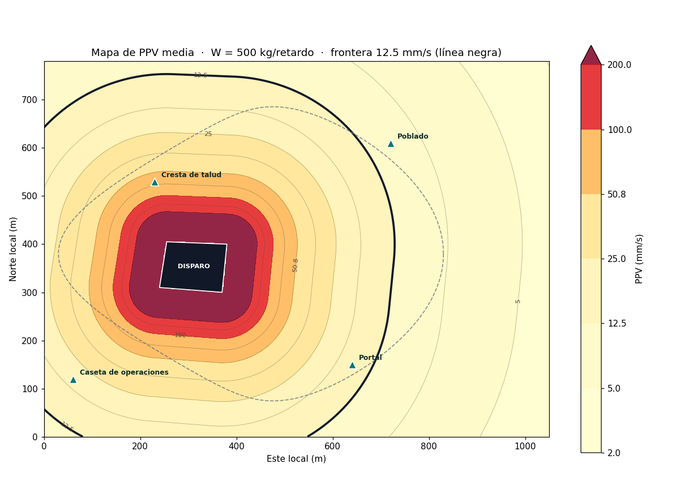
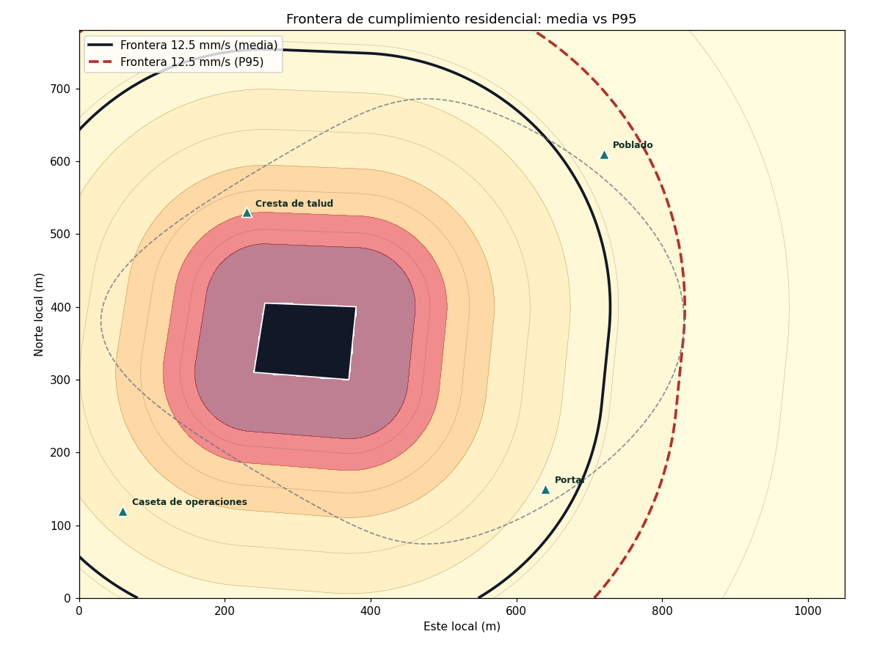
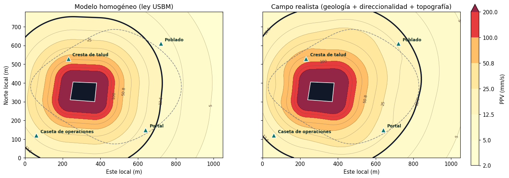
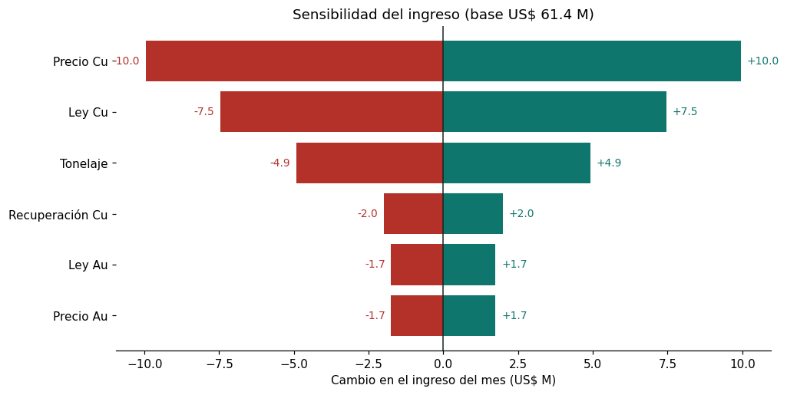
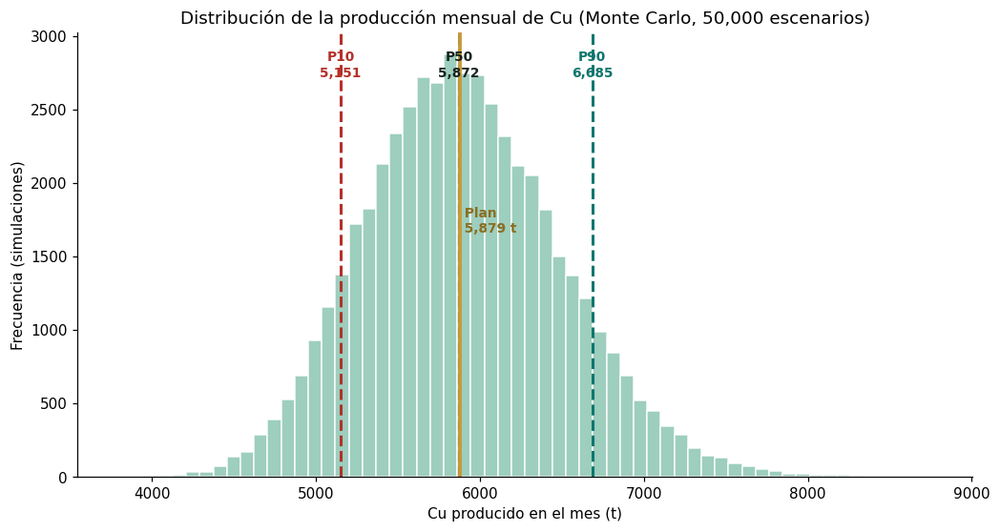

#### Si te resulta util este proyecto, apoyalo con un [](https://github.com/nrgarridoa/talleres-mineria-python/stargazers) en el repositorio.

---

# Talleres · Python aplicado a Minería

*Notebooks y datasets reproducibles que aplican Python a problemas reales de operación minera.*

Este repositorio es el hub de código de mis artículos técnicos: crece con cada artículo nuevo que publico. Cada carpeta es un taller autocontenido, listo para ejecutarse de principio a fin sin intervención manual.

[](https://nrgarridoa.github.io/articles/)

---

## Índice de Talleres

### Control de leyes

- **[`mineral-esteril`](mineral-esteril/)** — Clasificar mineral y estéril en un pórfido Cu-Mo a partir de ley de Cu y Mo · *Regresión logística + validación cruzada* · [Leer artículo →](https://nrgarridoa.github.io/articles/mineral-esteril/)

### Voladura / Geomecánica

- **[`vibraciones-ppv`](vibraciones-ppv/)** — Predecir la vibración (PPV) de una voladura según distancia y carga · *Modelo USBM (regresión log-log)* · [Leer artículo →](https://nrgarridoa.github.io/articles/vibraciones/)
- **[`ppv-isolineas`](ppv-isolineas/)** — Mapear la PPV de un disparo sobre el plano de mina y su frontera de cumplimiento · *Campo espacial + isolíneas (Matplotlib / Plotly)* · [Leer artículo →](https://nrgarridoa.github.io/articles/ppv-isolineas/)

### Planeamiento minero

- **[`modelo-produccion`](modelo-produccion/)** — Modelo de producción Cu-Au (tonelaje, ley, recuperación), valor, ley de corte, sensibilidad e incertidumbre · *Contabilidad metalúrgica + Monte Carlo* · [Leer artículo →](https://nrgarridoa.github.io/articles/modelo-produccion/)

---

<details>
<summary><strong>Vista previa y hallazgos por taller (clic para expandir)</strong></summary>

### `mineral-esteril` — Clasificar mineral y estéril

<table>
<tr>
<td></td>
<td></td>
</tr>
</table>

- La regresión logística con dos variables geoquímicas (Cu, Mo) alcanza **AUC ≈ 0.93** y **~89 % de acierto**, validado con 5-fold CV (AUC 0.929 ± 0.043).
- El modelo recupera la dirección del *ground truth*: el **Cu domina la decisión** (~3× el peso de Mo), consistente con la geoquímica de un pórfido Cu-Mo.
- El umbral de decisión no queda fijo en 0.5: se ajusta minimizando el costo total según cuánto cuesta diluir (falso positivo) frente a perder mineral (falso negativo).

### `vibraciones-ppv` — Predicción de PPV con el modelo USBM

<table>
<tr>
<td></td>
<td></td>
</tr>
</table>

- Modelo ajustado: **PPV = 1065 · SD⁻¹·⁶¹⁸⁵** (R² = 0.956 en espacio log-log), muy cerca del sitio simulado (K=1000, β=1.60).
- Validación cruzada 5-fold estable: **R² = 0.952 ± 0.011**.
- Residuos normales (Shapiro-Wilk, p = 0.128) → los **intervalos de predicción al 95 %** son válidos para diseño conservador.
- Se traduce directo a reglas de campo: carga máxima por retardo y distancia mínima segura según el límite normativo (NTP, USBM).

### `ppv-isolineas` — Mapa de isolíneas de PPV (Vibraciones · Parte 2)

<table>
<tr>
<td></td>
<td></td>
</tr>
<tr>
<td colspan="2" align="center"></td>
</tr>
</table>

- La ley USBM de la Parte 1 se lleva al plano como un **campo de PPV** y se contornea en isolíneas; la **frontera de 12.5 mm/s** separa cumplimiento de excedencia. Distancia al **polígono del disparo**, no al centroide.
- El **receptor vinculante** no es el más cercano ni el de mayor PPV: la cresta de talud recibe 64 mm/s y cumple, pero el poblado (10 mm/s, límite residencial 12.5) fija el diseño. El **mapa P95** (×1.52) lo hace exceder → bajar la carga de **500 a 393 kg/retardo**.
- El **campo realista** (heterogeneidad geológica + direccionalidad de la cara libre + topografía) deforma las isolíneas: se **abultan hacia el poblado**, que pasa a exceder **ya en la media** (16.7 mm/s). El modelo homogéneo subestima el riesgo donde la geometría del disparo enfoca la energía.

### `modelo-produccion` — Modelo de producción minera (Planeamiento)

<table>
<tr>
<td></td>
<td></td>
</tr>
</table>

- La **contabilidad metalúrgica** (tonelaje × ley × recuperación, con unidades correctas) es un modelo de producción completo en ~20 líneas: **5,879 t Cu, 5,106 oz Au, US$ 61.4 M**. El **oro subproducto** baja la ley de corte del Cu de **0.246 % a 0.119 %**.
- El **tornado de sensibilidad** ordena las palancas: **precio y ley de Cu dominan**, muy por encima del tonelaje. Donde más se gana es en la ley alimentada y la exposición al precio, no acelerando la pala.
- El **Monte Carlo** es la lección central: el plan determinístico (5,879 t) tiene solo **50 % de probabilidad de cumplirse** (es el P50). Comprometer producción exige bajar al **P80 (5,400 t)**.

</details>

---

## Estructura

Cada taller es independiente — notebook, dataset y dependencias propias. No necesitas instalar nada de más para probar solo el que te interesa.

```
<taller>/
├── notebooks/<taller>.ipynb   # análisis reproducible, de principio a fin
├── data/raw/<dataset>.csv     # dataset ya incluido, listo para usar
└── requirements.txt           # solo lo que ese taller necesita
```

---

## Cómo ejecutar un taller

1. **Clonar el repositorio**
   ```
   git clone https://github.com/nrgarridoa/talleres-mineria-python.git
   ```

2. **Entrar a la carpeta del taller que te interesa**
   ```
   cd mineral-esteril
   ```

3. **Instalar solo sus dependencias**
   ```
   pip install -r requirements.txt
   ```

4. **Abrir el notebook**
   ```
   jupyter lab notebooks/
   ```

---

## Stack tecnológico

| Herramienta | Uso |
|---|---|
| **Python** | Lenguaje base de los talleres |
| **pandas / NumPy** | Manipulación y generación de datos sintéticos |
| **scikit-learn** | Regresión logística, escalado, validación cruzada |
| **SciPy** | Regresión log-log (USBM), test de Shapiro-Wilk |
| **Matplotlib** | Visualización: EDA, fronteras, curvas de ajuste, residuos, isolíneas |
| **Plotly** | Mapa interactivo de isolíneas de PPV (contornos + receptores) |
| **Jupyter Lab** | Entorno de ejecución de los notebooks |
| **Git / GitHub** | Versionamiento y publicación |

---

## Autor

### Nilson Rolando Garrido Asenjo

**Mining Engineer | Data Analyst | Power BI Developer**

[](https://nrgarridoa.github.io)
[](https://www.linkedin.com/in/nrgarridoa)
[](https://www.youtube.com/@nrgarridoa)
[](mailto:nrgarridoa@gmail.com)

Ingeniero de Minas (UNC, primer puesto) y Administrador Industrial (SENATI) con trayectoria en gran mineria, industria farmaceutica y manufactura de alimentos. He liderado equipos de campo en Newmont Yanacocha, Gold Fields y Silver Mountain, dirigido proyectos tecnologicos en CODEa UNI y ejecutado consultoria de reconciliacion de mineral para Chinalco y reportabilidad operativa para Antamina.

Mi enfoque es transformar datos operativos en inteligencia para la toma de decisiones, combinando experiencia de campo con herramientas como Power BI, Python, SQL y DAX. Piloto de drones con operaciones en superficie (fotogrametria, volumetria) y en subterranea (LiDAR con Elios 3 para Flyability). Docente de Power BI y Python aplicado a mineria.

Formacion continua en Platzi, Coursera, iSE-Latam y Netzun en analitica de datos, programacion, gestion agil de proyectos y tecnologias mineras.

[](https://github.com/nrgarridoa)

---

[MIT License](https://github.com/nrgarridoa/talleres-mineria-python/blob/main/LICENSE)
